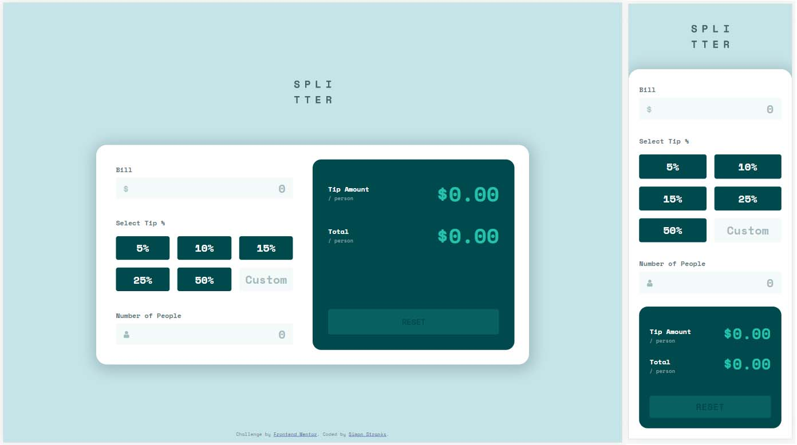

# Frontend Mentor - Tip calculator app solution

This is a solution to the [Tip calculator app challenge on Frontend Mentor](https://www.frontendmentor.io/challenges/tip-calculator-app-ugJNGbJUX). Frontend Mentor challenges help you improve your coding skills by building realistic projects.

## Table of contents

- [Overview](#overview)
  - [The challenge](#the-challenge)
  - [Screenshot](#screenshot)
  - [Links](#links)
- [My process](#my-process)
  - [Built with](#built-with)
- [Author](#author)

## Overview

### The challenge

Users should be able to:

- View the optimal layout for the app depending on their device's screen size
- See hover states for all interactive elements on the page
- Calculate the correct tip and total cost of the bill per person

### Screenshot

### Links

- Solution URL: [@SStranks87](https://github.com/SStranks/MyFirstRepository/tree/master/FrontEndMentor/14_Tip_Calculator_App)
- Live Site URL: [@Netlify](https://brave-albattani-9c7a7d.netlify.app/)

## My process

### Built with

- Semantic HTML5 markup
- CSS custom properties
- Flexbox
- CSS Grid
- Mobile-first workflow

### What I learned

- Can't alter the CSS ::after ::before using JS without serious expenditure.
- Can push the background beyond a Div container by using positive padding negative margin.
- JS event - 'change' vs 'input'
- Can place Icons inside input by using 'grid' on a div containing both elements - note! The input 'outline'
  when in focus will betray the size of the div; alternative is to use 'position: abs' on the icon instead of 'grid'
  on div.
- DON'T alter the styles of buttons directly or you break the 'hover', as JS.style supercedes CSS rules;
    Instead: Add/Remove Classes.
- Bug: 10/3 gives long fraction which distorts the visual elements! Ensure decimal fixed to 2 places.

## Author

- Frontend Mentor - [@SStranks](https://www.frontendmentor.io/profile/SStranks)
