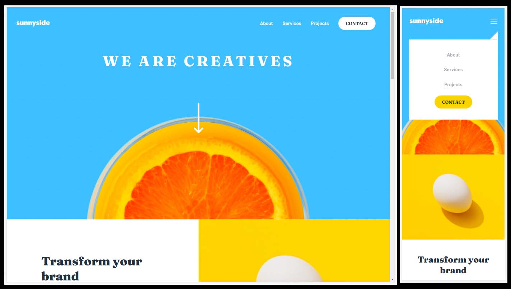

# Frontend Mentor - Sunnyside agency landing page solution

This is a solution to the [Sunnyside agency landing page challenge on Frontend Mentor](https://www.frontendmentor.io/challenges/sunnyside-agency-landing-page-7yVs3B6ef). Frontend Mentor challenges help you improve your coding skills by building realistic projects.

## Table of contents

- [Overview](#overview)
  - [The challenge](#the-challenge)
  - [Screenshot](#screenshot)
  - [Links](#links)
- [My process](#my-process)
  - [Built with](#built-with)
  - [What I learned](#what-I-learned)
- [Author](#author)

## Overview

### The challenge

Users should be able to:

- View the optimal layout for the site depending on their device's screen size
- See hover states for all interactive elements on the page

### Screenshot

### Links

- Solution URL: [@SStranks87](https://github.com/SStranks/MyFirstRepository/tree/master/FrontEndMentor/15_Sunnyside_Agency)
- Live Site URL: [@Netlify](https://affectionate-agnesi-337e50.netlify.app/)
## My process

### Built with

- Semantic HTML5 markup
- CSS custom properties
- Flexbox
- CSS Grid
- JavaScript

### What I learned

- Whilst programming the JavaScript I found a solution using a depreciated method, 'addListener', and had to seek another solution using the 'addEventListener' method instead using the 'Change' argument to handle the change in media query states. 
- Setting IMG's to 'block' in order to remove the border element that comes with 'inline-block' as default; affected page width.

## Author

- Frontend Mentor - [@SStranks](https://www.frontendmentor.io/profile/SStranks)
