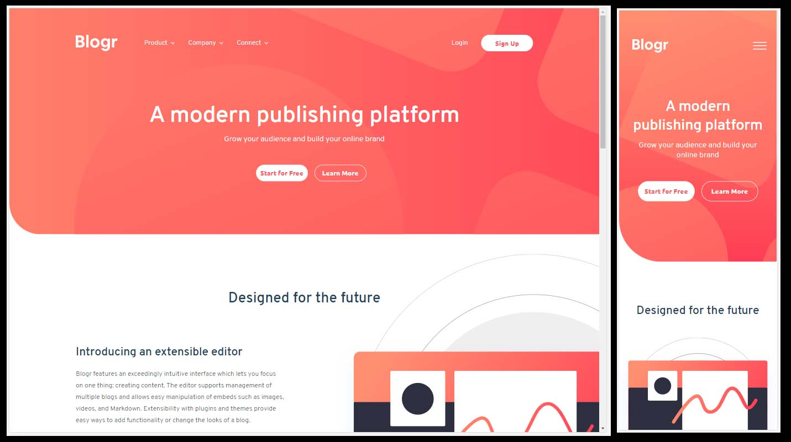

# Frontend Mentor - Blogr landing page solution

This is a solution to the [Blogr landing page challenge on Frontend Mentor](https://www.frontendmentor.io/challenges/blogr-landing-page-EX2RLAApP). Frontend Mentor challenges help you improve your coding skills by building realistic projects. 

## Table of contents

- [Overview](#overview)
  - [The challenge](#the-challenge)
  - [Screenshot](#screenshot)
  - [Links](#links)
- [My process](#my-process)
  - [Built with](#built-with)
  - [What I learned](#what-I-learned)
- [Author](#author)

## Overview

### The challenge

Users should be able to:

- View the optimal layout for the site depending on their device's screen size
- See hover states for all interactive elements on the page

### Screenshot

### Links

- Solution URL: [@SStranks87](https://github.com/SStranks/MyFirstRepository/tree/master/FrontEndMentor/16_Blogr_Landing_Page)
- Live Site URL: [@Netlify](https://ecstatic-pasteur-e70e10.netlify.app/)

## My process

### Built with

- Semantic HTML5 markup
- CSS custom properties
- Flexbox
- CSS Grid

### What I learned

- Z-Index issue with drop-down menus; Ensure the Z-Index is set on the outermost parent element rather than just the specific element (drop-down menu), so that it will all sit above any outer sibling elements.

## Author

- Frontend Mentor - [@SStranks](https://www.frontendmentor.io/profile/SStranks)
