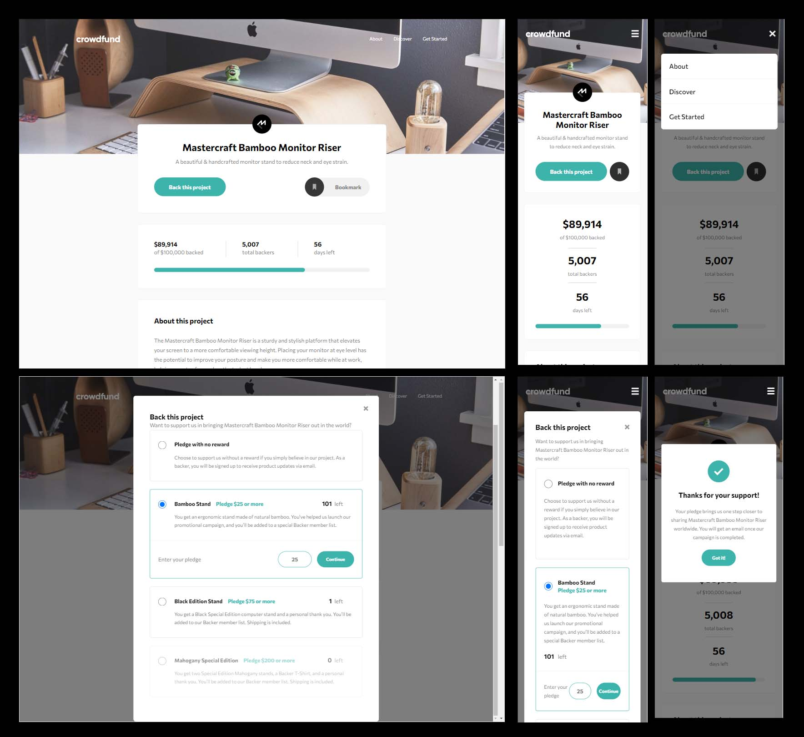

# Frontend Mentor - Crowdfunding product page solution

This is a solution to the [Crowdfunding product page challenge on Frontend Mentor](https://www.frontendmentor.io/challenges/crowdfunding-product-page-7uvcZe7ZR). Frontend Mentor challenges help you improve your coding skills by building realistic projects. 

## Table of contents

- [Overview](#overview)
  - [The challenge](#the-challenge)
  - [Screenshot](#screenshot)
  - [Links](#links)
- [My process](#my-process)
  - [Built with](#built-with)
  - [What I learned](#what-I-learned)
- [Author](#author)

## Overview

### The challenge

Users should be able to:

- View the optimal layout depending on their device's screen size
- See hover states for interactive elements
- Make a selection of which pledge to make
- See an updated progress bar and total money raised based on their pledge total after confirming a pledge
- See the number of total backers increment by one after confirming a pledge
- Toggle whether or not the product is bookmarked

### Screenshot

### Links

- Solution URL: [@SStranks87](https://github.com/SStranks/MyFirstRepository/tree/master/FrontEndMentor/17_Crowdfunding_Product)
- Live Site URL: [@Netlify](https://happy-lewin-237475.netlify.app/)

## My process

### Built with

- Semantic HTML5 markup
- CSS custom properties
- Flexbox
- CSS Grid

### What I learned

- 'Object' won't register a click event if the SVG is external, even with a load event handler. Wrap in a DIV and turn off 'pointer-events' on the object.
- Inputs won't take ::after or ::before due to there being no content with the input itself - can wrap it in a DIV and modify that instead.

## Author

- Frontend Mentor - [@SStranks](https://www.frontendmentor.io/profile/SStranks)