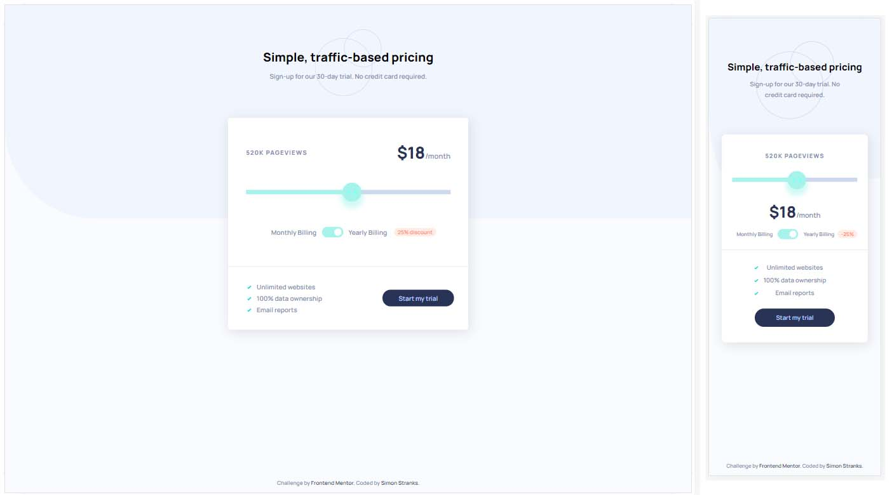

# Frontend Mentor - Interactive pricing component solution

This is a solution to the [Interactive pricing component challenge on Frontend Mentor](https://www.frontendmentor.io/challenges/interactive-pricing-component-t0m8PIyY8). Frontend Mentor challenges help you improve your coding skills by building realistic projects. 

## Table of contents

- [Overview](#overview)
  - [The challenge](#the-challenge)
  - [Screenshot](#screenshot)
  - [Links](#links)
- [My process](#my-process)
  - [Built with](#built-with)
  - [What I learned](#what-i-learned)
  - [Useful resources](#useful-resources)
- [Author](#author)

## Overview

### The challenge

Users should be able to:

- View the optimal layout for the app depending on their device's screen size
- See hover states for all interactive elements on the page
- Use the slider and toggle to see prices for different page view numbers

### Screenshot

### Links

- Solution URL: [@SStranks87](https://github.com/SStranks/MyFirstRepository/tree/master/FrontEndMentor/18_Interactive_Pricing)
- Live Site URL: [@Netlify](https://cocky-austin-41a9ad.netlify.app/)

## My process

### Built with

- Semantic HTML5 markup
- CSS custom properties
- Flexbox
- CSS Grid

### What I learned

- The 'Range' slider had to be hacked together using both the HTML5 object and a separate DIV for the customized colour track to the left of the button on the slider. 

### Useful resources

- [How to Create a Toggle Switch](https://www.w3schools.com/howto/howto_css_switch.asp) - This guide from W3 showed me the fundamentals for creating a toggle switch for the page.
- [How to Create a Slider Switch](https://www.w3schools.com/howto/howto_js_rangeslider.asp) - This guide from W3 showed me the fundamentals for creating a slider for the page.
- [Range Slider with fill colour](https://codepen.io/steveholgado/pen/OEpGXq) - Pen by S. Holgado showing how to add colour to the range.

## Author

- Frontend Mentor - [@SStranks](https://www.frontendmentor.io/profile/SStranks)