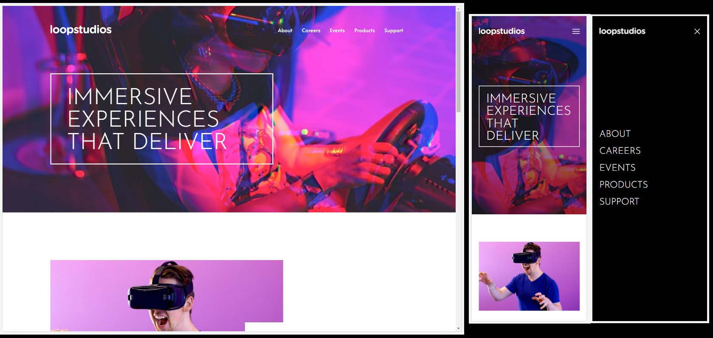

# Frontend Mentor - Loopstudios landing page solution

This is a solution to the [Loopstudios landing page challenge on Frontend Mentor](https://www.frontendmentor.io/challenges/loopstudios-landing-page-N88J5Onjw). Frontend Mentor challenges help you improve your coding skills by building realistic projects. 

## Table of contents

- [Overview](#overview)
  - [The challenge](#the-challenge)
  - [Screenshot](#screenshot)
  - [Links](#links)
- [My process](#my-process)
  - [Built with](#built-with)
  - [What I learned](#what-i-learned)
- [Author](#author)

## Overview

### The challenge

Users should be able to:

- View the optimal layout for the site depending on their device's screen size
- See hover states for all interactive elements on the page

### Screenshot

### Links

- Solution URL: [@SStranks87](https://github.com/SStranks/MyFirstRepository/tree/master/FrontEndMentor/19_Loopstudios_Landing)
- Live Site URL: [@Netlify](https://romantic-jepsen-2e1ace.netlify.app/)

## My process

### Built with

- Semantic HTML5 markup
- CSS custom properties
- Flexbox
- CSS Grid

### What I learned

- Had some minor experimentations with transitions and animations, and also with the filter effects.

## Author

- Frontend Mentor - [@SStranks](https://www.frontendmentor.io/profile/SStranks)

