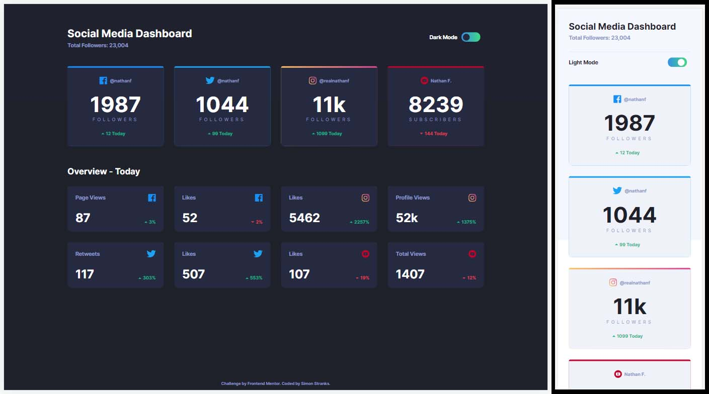

# Frontend Mentor - Social media dashboard with theme switcher solution

This is a solution to the [Social media dashboard with theme switcher challenge on Frontend Mentor](https://www.frontendmentor.io/challenges/social-media-dashboard-with-theme-switcher-6oY8ozp_H). Frontend Mentor challenges help you improve your coding skills by building realistic projects. 

## Table of contents

- [Overview](#overview)
  - [The challenge](#the-challenge)
  - [Screenshot](#screenshot)
  - [Links](#links)
- [My process](#my-process)
  - [Built with](#built-with)
  - [What I learned](#what-i-learned)
- [Author](#author)

## Overview

### The challenge

Users should be able to:

- View the optimal layout for the site depending on their device's screen size
- See hover states for all interactive elements on the page
- Toggle color theme to their preference

### Screenshot

### Links

- Solution URL: [@SStranks87](https://github.com/SStranks/MyFirstRepository/tree/master/FrontEndMentor/23_Social_Media_Dashboard)
- Live Site URL: [@Netlify](https://flamboyant-mirzakhani-ca3dfd.netlify.app/)

## My process

### Built with

- Semantic HTML5 markup
- CSS custom properties
- Flexbox
- CSS Grid

### What I learned

- You can't use a linear-gradient on the 'border' property, so to get around this I had to nest a DIV inside another DIV and offset the top edge with padding to reveal the linear-gradient on the background of the parent DIV: https://css-tricks.com/gradient-borders-in-css/
- In order to stop transitions from firing on page load I had to add a class disabling all transitions, then remove that class once the page has finished loading completely: https://css-tricks.com/transitions-only-after-page-load/

## Author

- Frontend Mentor - [@SStranks](https://www.frontendmentor.io/profile/SStranks)