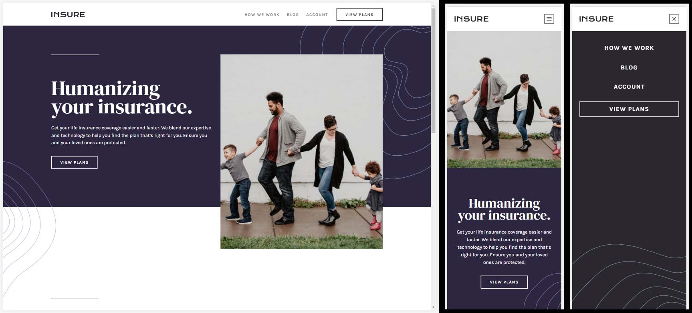

# Frontend Mentor - Insure landing page solution

This is a solution to the [Insure landing page challenge on Frontend Mentor](https://www.frontendmentor.io/challenges/insure-landing-page-uTU68JV8). Frontend Mentor challenges help you improve your coding skills by building realistic projects. 

## Table of contents

- [Overview](#overview)
  - [The challenge](#the-challenge)
  - [Screenshot](#screenshot)
  - [Links](#links)
- [My process](#my-process)
  - [Built with](#built-with)
  - [What I learned](#what-i-learned)
  - [Continued development](#continued-development)
  - [Useful resources](#useful-resources)
- [Author](#author)

## Overview

### The challenge

Users should be able to:

- View the optimal layout for the site depending on their device's screen size
- See hover states for all interactive elements on the page

### Screenshot

### Links

- Solution URL: [@SStranks87](https://github.com/SStranks/MyFirstRepository/tree/master/FrontEndMentor/24_Insure_Landing_Page)
- Live Site URL: [@Netlify](https://objective-panini-4d85b7.netlify.app/)

## My process

### Built with

- Semantic HTML5 markup
- CSS custom properties
- Flexbox
- CSS Grid

### What I learned

- The two main things I learned in this challenge were dealing with collapsing margins and why they occur, and figuring out how to adjust the fill state of externally referenced SVGs using JavaScript that also combined with the mouseenter/mouseleave events. I learned that the addEventListener method has a third parameter that can be set in order to listen on the 'capture' phase of events (mouseenter/leave does not bubble like mouseover), so that I could capture the event on a single eventlistener attributed to the parent element of all the elements that I wished to monitor as in normal event delegation.

https://developer.mozilla.org/en-US/docs/Web/API/Element/mouseenter_event
https://stackoverflow.com/questions/50177348/mouseenter-delegation-using-vanilla-javascript
http://complexspiral.com/publications/uncollapsing-margins/

## Author

- Frontend Mentor - [@SStranks](https://www.frontendmentor.io/profile/SStranks)