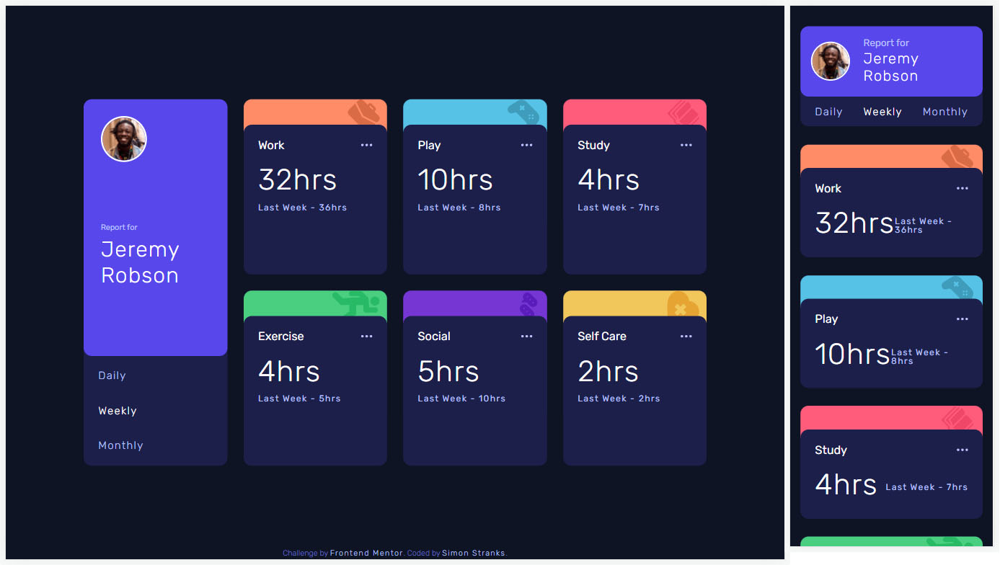

# Frontend Mentor - Time tracking dashboard solution

This is a solution to the [Time tracking dashboard challenge on Frontend Mentor](https://www.frontendmentor.io/challenges/time-tracking-dashboard-UIQ7167Jw). Frontend Mentor challenges help you improve your coding skills by building realistic projects.

## Table of contents

- [Overview](#overview)
  - [The challenge](#the-challenge)
  - [Screenshot](#screenshot)
  - [Links](#links)
- [My process](#my-process)
  - [Built with](#built-with)
- [Author](#author)

## Overview

### The challenge

Users should be able to:

- View the optimal layout for the site depending on their device's screen size
- See hover states for all interactive elements on the page
- Switch between viewing Daily, Weekly, and Monthly stats

### Screenshot

### Links

- Solution URL: [@SStranks87](https://github.com/SStranks/MyFirstRepository/tree/master/FrontEndMentor/27_Time_Tracking_Dashboard/timetrackdash)
- Live Site URL: [@Netlify](https://620ff8894ecaaa2e646c6f95--nervous-mirzakhani-46e315.netlify.app/)

## My process

### Built with

- Semantic HTML5 markup
- CSS Grid
- SASS
- [React](https://reactjs.org/) - JS library

## Author

- Frontend Mentor - [@SStranks](https://www.frontendmentor.io/profile/SStranks)
