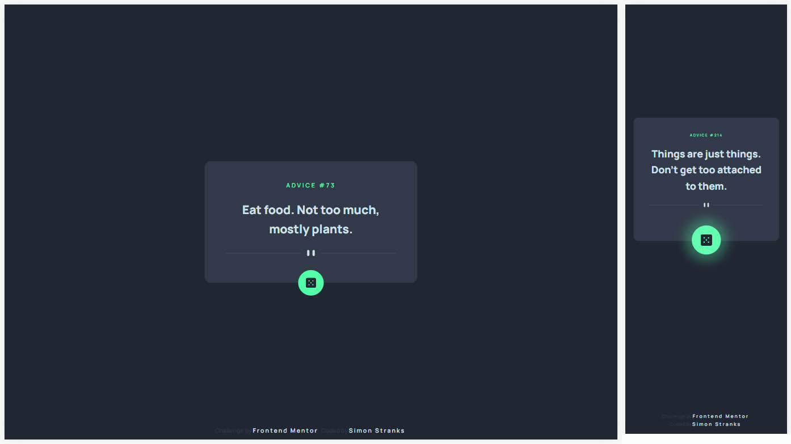

# Frontend Mentor - Advice generator app solution

This is a solution to the [Advice generator app challenge on Frontend Mentor](https://www.frontendmentor.io/challenges/advice-generator-app-QdUG-13db). Frontend Mentor challenges help you improve your coding skills by building realistic projects.

## Table of contents

- [Overview](#overview)
  - [The challenge](#the-challenge)
  - [Screenshot](#screenshot)
  - [Links](#links)
- [My process](#my-process)
  - [Built with](#built-with)
- [Author](#author)

## Overview

### The challenge

Your users should be able to:

- View the optimal layout for the app depending on their device's screen size
- See hover states for all interactive elements on the page
- Generate a new piece of advice by clicking the dice icon

### Screenshot

### Links

- Solution URL: [@SStranks87](https://github.com/SStranks/MyFirstRepository/tree/master/FrontEndMentor/28_Advice_Gen_App/advice-gen-app)
- Live Site URL: [@Netlify](https://blissful-elion-6f802c.netlify.app/)

## My process

### Built with

- Semantic HTML5 markup
- Flexbox
- SASS
- [React](https://reactjs.org/) - JS library
- [GSAP](https://greensock.com/) - JS library

## Author

- Frontend Mentor - [@SStranks](https://www.frontendmentor.io/profile/SStranks)
