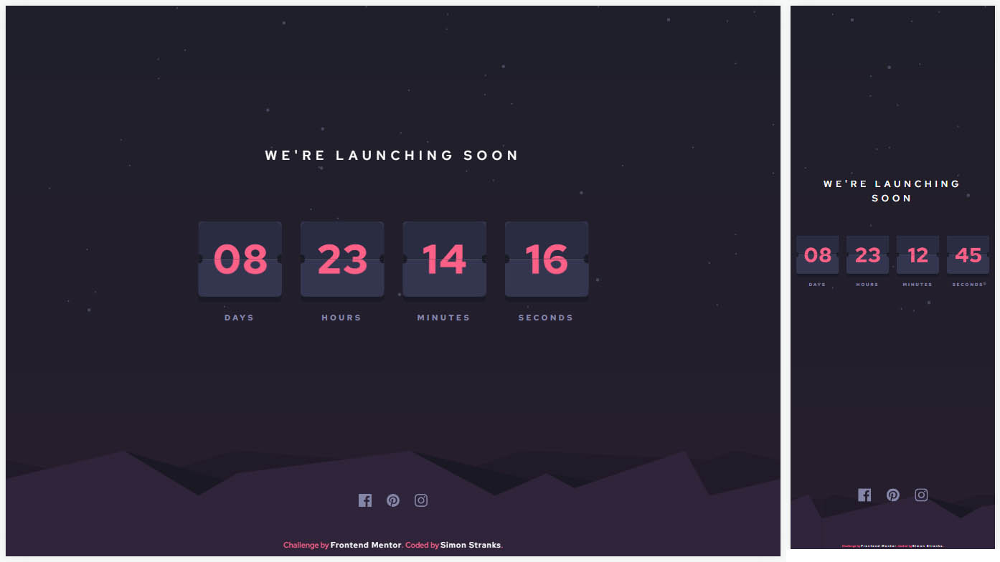

# Frontend Mentor - Launch countdown timer solution

This is a solution to the [Launch countdown timer challenge on Frontend Mentor](https://www.frontendmentor.io/challenges/launch-countdown-timer-N0XkGfyz-). Frontend Mentor challenges help you improve your coding skills by building realistic projects.

## Table of contents

- [Overview](#overview)
  - [The challenge](#the-challenge)
  - [Screenshot](#screenshot)
  - [Links](#links)
- [My process](#my-process)
  - [Built with](#built-with)
- [Resources](#resources)
- [Author](#author)

## Overview

### The challenge

Users should be able to:

- See hover states for all interactive elements on the page
- See a live countdown timer that ticks down every second (start the count at 14 days)
- **Bonus**: When a number changes, make the card flip from the middle

### Screenshot

### Links

- Solution URL: [@SStranks87](https://github.com/SStranks/MyFirstRepository/tree/master/FrontEndMentor/29_launch_countdown_timer)
- Live Site URL: [@Netlify](https://unruffled-wing-850716.netlify.app/)

## My process

### Built with

- Semantic HTML5 markup
- SASS
- Flexbox
- [React](https://reactjs.org/) - JS library

### Useful resources

- [How To Create Your First Game - JavaScript](https://www.youtube.com/watch?v=47eXVRJKdkU)
- [Using requestAnimationFrame with React Hooks](https://css-tricks.com/using-requestanimationframe-with-react-hooks/)
- [CSS filter generator to convert from black to target hex color](https://codepen.io/sosuke/pen/Pjoqqp)
- [Hsl to Hex](https://htmlcolors.com/hsl-to-hex)

## Author

- Frontend Mentor - [@SStranks](https://www.frontendmentor.io/profile/SStranks)
