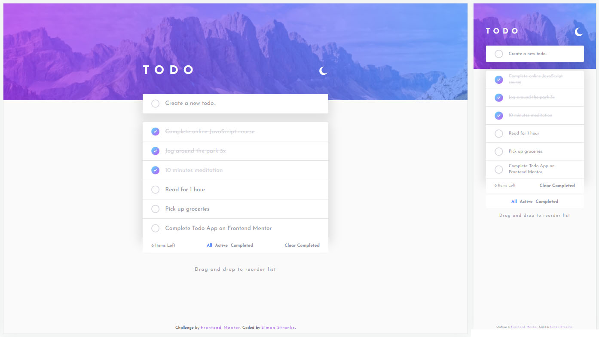

# Frontend Mentor - Todo app solution

This is a solution to the [Todo app challenge on Frontend Mentor](https://www.frontendmentor.io/challenges/todo-app-Su1_KokOW). Frontend Mentor challenges help you improve your coding skills by building realistic projects.

## Table of contents

- [Overview](#overview)
  - [The challenge](#the-challenge)
  - [Screenshot](#screenshot)
  - [Links](#links)
- [My process](#my-process)
  - [Built with](#built-with)
- [Resources](#resources)
- [Author](#author)

## Overview

### The challenge

Users should be able to:

- View the optimal layout for the app depending on their device's screen size
- See hover states for all interactive elements on the page
- Add new todos to the list
- Mark todos as complete
- Delete todos from the list
- Filter by all/active/complete todos
- Clear all completed todos
- Toggle light and dark mode
- **Bonus**: Drag and drop to reorder items on the list

### Screenshot

### Links

- Solution URL: [@SStranks87](https://github.com/SStranks/MyFirstRepository/tree/master/FrontEndMentor/30_todo_app)
- Live Site URL: [@Netlify](https://modest-rosalind-55ee5b.netlify.app/)

## My process

### Built with

- Semantic HTML5 markup
- SASS
- Flexbox
- [React](https://reactjs.org/) - JS library

### Useful resources

- [Drag And Drop With React Hooks From Scratch](https://www.youtube.com/watch?v=Q1PYQPK9TaM)
- [CodCamp: DnD without external libraries](https://www.freecodecamp.org/news/reactjs-implement-drag-and-drop-feature-without-using-external-libraries-ad8994429f1a/)

## Author

- Frontend Mentor - [@SStranks](https://www.frontendmentor.io/profile/SStranks)
