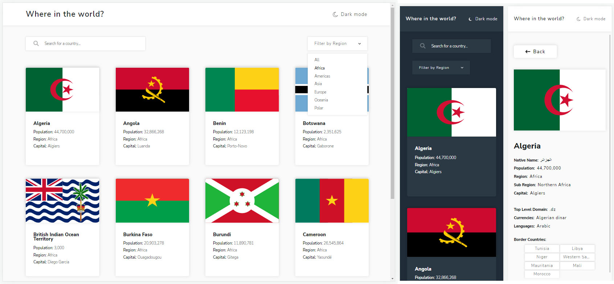

# Frontend Mentor - REST Countries API with color theme switcher solution

This is a solution to the [REST Countries API with color theme switcher challenge on Frontend Mentor](https://www.frontendmentor.io/challenges/rest-countries-api-with-color-theme-switcher-5cacc469fec04111f7b848ca). Frontend Mentor challenges help you improve your coding skills by building realistic projects.

## Table of contents

- [Overview](#overview)
  - [The challenge](#the-challenge)
  - [Screenshot](#screenshot)
  - [Links](#links)
- [My process](#my-process)
  - [Built with](#built-with)
  - [What I learned](#what-i-learned)
  - [Useful resources](#useful-resources)
- [Author](#author)

## Overview

### The challenge

Users should be able to:

- See all countries from the API on the homepage
- Search for a country using an `input` field
- Filter countries by region
- Click on a country to see more detailed information on a separate page
- Click through to the border countries on the detail page
- Toggle the color scheme between light and dark mode _(optional)_

### Screenshot

### Links

- Solution URL: [@SStranks87](https://github.com/SStranks/MyFirstRepository/tree/master/FrontEndMentor/31_rest_countries_api)
- Live Site URL: [@Netlify](https://competent-dijkstra-14789a.netlify.app/)

## My process

### Built with

- Semantic HTML5 markup
- CSS custom properties
- Flexbox
- CSS Grid
- [React](https://reactjs.org/) - JS library

### What I learned

Crikey! This challenge took a fair bit of thinking (and a refactor) to get it done. I think this was my 4th React App I've made, so I'm pretty happy I managed to get it working and saw it through to completion!

I learned a lot about React, the hard way, in particular with Async and dependencies. There was a need to refactor the logic halfway through because I failed to anticipate the need to load up individual SVG's for the modal, whereas the main page was loading in chunks initially. There was still room for optimizing the SVG loading, as it currently doesn't append to already loaded SVG's, but the filesizes for SVG's are tiny enough for this project.

I successfully implemented two features not required by the challenge:

- The API provided SVG and PNG flag links, and I decided to try and load the SVG and encode into the data the "preserve aspect ratio: none" attribute so that the SVGs could be resized to all match (some national flags have different aspect ratios!).
- Infinite scrolling of the flags on the main page. I had to utilize a tutorial to get this implemented as I hadn't come across the Intersection Observer before (or the general methodology).

Lots of other little learning points in there too with CSS, such as the Dark Theme using custom CSS variables and minor Grid tweaks.

All in all, a great learning experience!

### Useful resources

- [Infinite Scrolling with React](https://www.youtube.com/watch?v=NZKUirTtxcg)
- [CSS Dark Theme :root Variables](https://lukelowrey.com/css-variable-theme-switcher/NZKUirTtxcg)
- [Parse SVG](https://stackoverflow.com/questions/19273908/parse-svg-and-add-it-to-a-svg-element)
- [SVG string to IMG src](https://stackoverflow.com/questions/44900569/turning-an-svg-string-into-an-image-in-a-react-component)

## Author

- Frontend Mentor - [@SStranks](https://www.frontendmentor.io/profile/SStranks)
