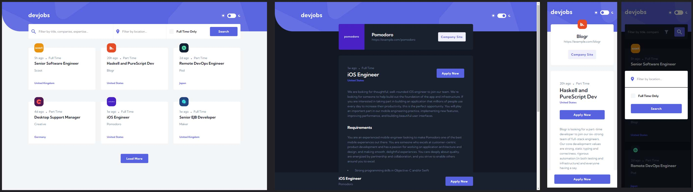

# Frontend Mentor - Devjobs web app solution

This is a solution to the [Devjobs web app challenge on Frontend Mentor](https://www.frontendmentor.io/challenges/devjobs-web-app-HuvC_LP4l). Frontend Mentor challenges help you improve your coding skills by building realistic projects.

## Table of contents

- [Overview](#overview)
  - [The challenge](#the-challenge)
  - [Screenshot](#screenshot)
  - [Links](#links)
- [My process](#my-process)
  - [Built with](#built-with)
  - [What I learned](#what-i-learned)
  - [Useful resources](#useful-resources)
- [Author](#author)

## Overview

### The challenge

Your challenge is to build out this jobs board using a local `data.json` to retrieve the data. Your goal is to try to get your project looking as close to the design as possible.

You can use any tools you like to help you complete the challenge. So if you've got something you'd like to practice, feel free to give it a go.

We provide the data in a local `data.json` file, so use that to populate the content on the first load. If you want to take it up a notch, feel free to build this as a full-stack application!

Users should be able to:

- View the optimal layout for each page depending on their device's screen size
- See hover states for all interactive elements throughout the site
- Be able to filter jobs on the index page by title, location, and whether a job is for a full-time position
- Be able to click a job from the index page so that they can read more information and apply for the job
- **Bonus**: Have the correct color scheme chosen for them based on their computer preferences. _Hint_: Research `prefers-color-scheme` in CSS.

### Screenshot

### Links

- Solution URL: [@SStranks87](https://github.com/SStranks/MyFirstRepository/tree/master/FrontEndMentor/32_dev_jobs_webapp)
- Live Site URL: [@Netlify]()

## My process

### Built with

- Semantic HTML5 markup
- CSS: modules, custom properties, grid, flexbox
- SASS
- ESLint, Prettier
- Webpack 5
- Nginx
- Docker
- [React](https://reactjs.org/) - JS library
- [NodeJS](https://nodejs.org/en/) - NodeJS
- [DockerHub](https://hub.docker.com/) - Docker Images

### What I learned

In this project I really pushed myself by learning several new technologies and processes, which proved a great challenge, and now I have a great template I can use for the MERN stack on future projects too! I successfully dockerized the entire project, for both development and production pathways, and this was also implemented inside my Windows WSL2 Ubuntu 'sandbox' environment as a 'rootless' docker environment (itself a challenge to setup!).

To better emulate a real-world deployed full-stack app I configured a simple Nginx arrangement - my first use of the technology - to route incoming requests to either the frontend server (another Nginx instance) to serve the index.html or route to the backend API server for requests. The backend server was connected to a MongoDB database - the production pathway links to a real MongoDB hosted on Mongo Atlas.

Rather than rely on Create-React-App to setup the frontend environment I opted to learn Webpack 5 and set it up manually. This was very beneficial, I learned an awful lot, and I will continue to use and build upon this approach in the next project.

The majority of the time I spent on this project went into setting up the development environment, searching for answers and scouring documentation. The process of manually setting it created many hiccups, which forced me to really dive deep. The actual time spent on React and NodeJS was smaller, and most of that in dealing with the media queries towards the end of development.

In the next project I hope to apply more time and finessse to the frontend and backend code, such as: full accessibility, BEM, proper care over units (REM, Ch), and expanding the functionality and depth of the backend logic.

### Useful resources

- [ESLint in Webpack 5 - Setup Tutorial](https://www.robinwieruch.de/webpack-eslint/)
- [Set up a Node.js App with ESLint and Prettier](https://blog.bitsrc.io/how-to-set-up-node-js-application-with-eslint-and-prettier-b1b7994db69f)
- [MERN stack w/ Nginx – Docker Compose](https://www.bezkoder.com/docker-mern/)
- [Dockerizing a MERN Stack](https://medium.com/mozilla-club-bbsr/dockerizing-a-mern-stack-web-application-ebf78babf136)
- [Run MERN Stack on Docker Compose](https://medium.com/bb-tutorials-and-thoughts/how-to-run-mern-stack-on-docker-compose-fad2050b9e)
- [Sass Folder Structure For React](https://dev.to/gedalyakrycer/ohsnap-sass-folder-structure-for-react-483e)
- [React without using CRA](https://blog.devgenius.io/how-to-create-a-react-app-without-using-create-react-app-c004a62b52fc)
- [Setting up CSS and Sass with Webpack](https://dev.to/deepanjangh/setting-up-css-and-sass-with-webpack-3cg)
- [React without CRA](https://dev.to/underscorecode/creating-your-react-project-from-scratch-without-create-react-app-the-complete-guide-4kbc)
- [Docker Destop WSL2 Backend](https://docs.docker.com/desktop/windows/wsl/)
- [Node-Sass will not compile/transpile @use "module"](https://stackoverflow.com/questions/59953385/node-sass-will-not-compile-transpile-use-module)
- [SASS-Loader](https://webpack.js.org/loaders/sass-loader/)
- [SASS: Breaking Change: Color Units](https://sass-lang.com/documentation/breaking-changes/color-units)
- [Webpack: Loading Images](https://webpack.js.org/guides/asset-management/#loading-images)
- [Webpack: Configure SCSS modules](https://www.developerhandbook.com/webpack/how-to-configure-scss-modules-for-webpack/)
- [Pure CSS Custom Checkbox Style](https://moderncss.dev/pure-css-custom-checkbox-style/)
- [Fixing cannot GET/URL - React Router](https://ui.dev/react-router-cannot-get-url-refresh)
- [SASS: Responsive Web Design and Breakpoints](https://sass-guidelin.es/#responsive-web-design-and-breakpoints)
- [Class Names via CSS Modules](https://stackoverflow.com/questions/69043268/class-names-via-css-modules-are-generated-in-a-strange-way)
- [How to Pass Props Through React Router's Link Component](https://ui.dev/react-router-pass-props-to-link)
- [Nginx Issue](https://stackoverflow.com/questions/64112684/nginx-cant-find-upstream-host-in-multi-container-docker-compose-setup-and-also)

## Author

- Frontend Mentor - [@SStranks](https://www.frontendmentor.io/profile/SStranks)
