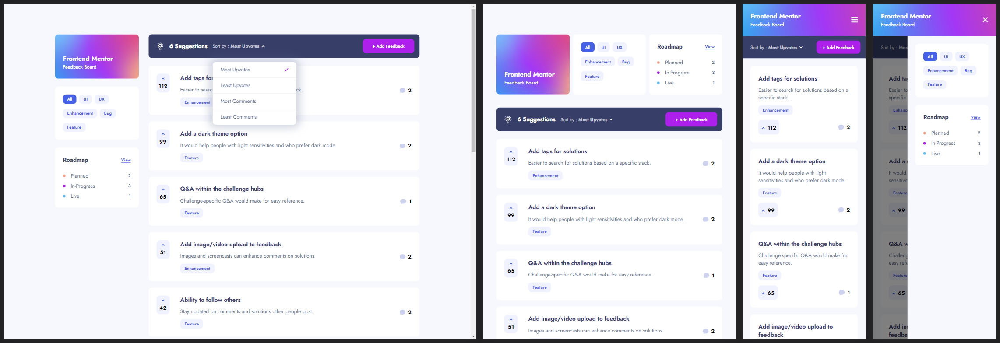

# Frontend Mentor - Product Feedback App

This is my solution to the [Product feedback app challenge on Frontend Mentor](https://www.frontendmentor.io/challenges/product-feedback-app-wbvUYqjR6).

## Table of contents

- [Overview](#overview)
  - [The challenge](#the-challenge)
  - [Screenshot](#screenshot)
  - [Links](#links)
- [My process](#my-process)
  - [Built with](#built-with)
  - [What I learned](#what-i-learned)
  - [Useful resources](#useful-resources)

## Overview

### The challenge

#### Difficulty Rating: Level 5/5 (Guru)

Users should be able to:

- View the optimal layout for the app depending on their device's screen size
- See hover states for all interactive elements on the page
- Create, read, update, and delete product feedback requests
- Receive form validations when trying to create/edit feedback requests
- Sort suggestions by most/least upvotes and most/least comments
- Filter suggestions by category
- Add comments and replies to a product feedback request
- Upvote product feedback requests
- **Bonus**: Keep track of any changes, even after refreshing the browser (`localStorage` could be used for this if you're not building out a full-stack app)

### Screenshot

Captured at the following breakpoints from the live solution: Desktop - 1440px, Tablet - 768px, - Mobile: 375px.

### Links

- Live Site - [@Netlify]()
- GitHub - [@GitHub](https://github.com/SStranks/MyFirstRepository/tree/master/FrontEndMentor/33_project_feedback_app)
- FrontEndMentor Challenge - [@FrontEndMentor](https://www.frontendmentor.io/challenges/product-feedback-app-wbvUYqjR6)
- FrontEndMentor Profile - [@SStranks](https://www.frontendmentor.io/profile/SStranks)

## My process

### Built with

- Semantic HTML5
- CSS/SASS; custom architecture, modules, flexbox, grid
- React
- Webpack 5
- Nginx
- Docker
- [DockerHub](https://hub.docker.com/)

### What I learned

### Useful resources
