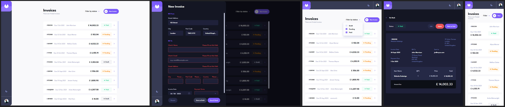

# Frontend Mentor - Invoice App Solution

This is my solution for the [Invoice app challenge on Frontend Mentor](https://www.frontendmentor.io/challenges/invoice-app-i7KaLTQjl).

## Table of contents

- [Overview](#overview)
  - [The challenge](#the-challenge)
  - [Screenshot](#screenshot)
  - [Links](#links)
- [My process](#my-process)
  - [Built with](#built-with)
  - [What I learned](#what-i-learned)
  - [Useful resources](#useful-resources)

## Overview

### The challenge

#### Difficulty Rating: Level 5/5 (Guru)

Users should be able to:

- View the optimal layout for the app depending on their device's screen size
- See hover states for all interactive elements on the page
- Create, read, update, and delete invoices
- Receive form validations when trying to create/edit an invoice
- Save draft invoices, and mark pending invoices as paid
- Filter invoices by status (draft/pending/paid)
- Toggle light and dark mode
- **Bonus**: Keep track of any changes, even after refreshing the browser (`localStorage` could be used for this if you're not building out a full-stack app)

### Screenshot

Captured at the following breakpoints from the live solution: Desktop - 1440px, Tablet - 768px, - Mobile: 375px.

### Links

- Live Site - [@Netlify]()
- GitHub - [@GitHub](https://github.com/SStranks/MyFirstRepository/tree/master/FrontEndMentor/34_invoice_app)
- FrontEndMentor Challenge - [@FrontEndMentor](https://www.frontendmentor.io/challenges/invoice-app-i7KaLTQjl)
- FrontEndMentor Profile - [@SStranks](https://www.frontendmentor.io/profile/SStranks)

## My process

### Built with

- Semantic HTML5
- CSS/SASS; custom architecture, modules, flexbox, grid
- Typescript and React
- Webpack 5
- Nginx
- Docker
- [DockerHub](https://hub.docker.com/)

### What I learned

### Useful resources

- [TS ESLint - no-unused-vars](https://typescript-eslint.io/rules/no-unused-vars/)
- [TS and Webpack 5](https://blog.logrocket.com/using-webpack-typescript/)
- [TS and NodeJS Setup](https://ultimatecourses.com/blog/setup-typescript-nodejs-express#project-setup)
- [TS and NodeJS Setup](https://www.digitalocean.com/community/tutorials/setting-up-a-node-project-with-typescript)
- [TS, React, Webpack 5: Setup](https://www.carlrippon.com/creating-react-app-with-typescript-eslint-with-webpack5/)
- [TS, React, Webpack 5, Babel: Setup](https://dev.to/deadwing7x/setup-a-react-app-using-webpack-babel-and-typescript-5927)
- [TS Config: Official Docs](https://www.typescriptlang.org/tsconfig)
- [TS and Webpack 5: Configuring Aliases](https://www.basefactor.com/configuring-aliases-in-webpack-vs-code-typescript-jest)
- [NPM: eslint-import-resolver-typrscript](https://www.npmjs.com/package/eslint-import-resolver-typescript)
- [React Portals & Modals](https://dev.to/link2twenty/react-using-portals-to-make-a-modal-2kdf)
- [React Query - Mutation Promises](https://tanstack.com/query/v4/docs/react/guides/mutations#promises)
- [Github - ESLint](https://github.com/expressjs/generator/issues/78)
- [Github - TS and Webpack 5](https://github.com/webpack/webpack/discussions/15076#discussioncomment-1887720)
- [Github - TS and ESLint-Plugin-Import](https://github.com/import-js/eslint-plugin-import/issues/1485)
- [Github - TS and SASS Modules](https://github.com/vercel/next.js/issues/9690)
- [Github - TS Config](https://github.com/microsoft/TypeScript/issues/43838)
- [Stackoverflow - TS and ESLint](https://stackoverflow.com/questions/59265981/typescript-eslint-missing-file-extension-ts-import-extensions)
- [Stackoverflow - TS Config and ESLint](https://stackoverflow.com/questions/62474451/tsconfigs-path-parameter-and-eslint)
- [Stackoverflow - TS and NodeJS](https://stackoverflow.com/questions/40616272/an-import-path-cannot-end-with-ts-nodejs-and-visual-code)
- [Stackoverflow - TS Config and JSX](https://stackoverflow.com/questions/64656055/react-refers-to-a-umd-global-but-the-current-file-is-a-module)
- [Stackoverflow - TS Type; setState](https://stackoverflow.com/questions/65823778/how-can-i-define-typescript-type-for-a-setstate-function-when-react-dispatchrea)
- [Stackoverflow - Webkit-Scrollbar-Thumb](https://stackoverflow.com/questions/16819116/unable-to-set-the-width-of-webkit-scrollbar-thumb)
