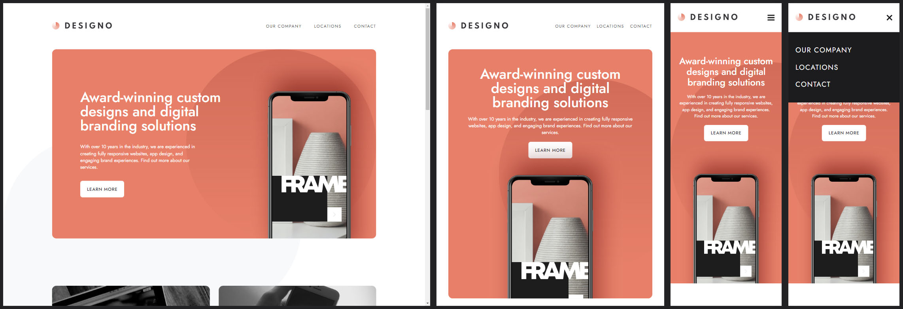

# Frontend Mentor - Designo Agency Website

This is my solution for the [Designo agency website challenge on Frontend Mentor](https://www.frontendmentor.io/challenges/designo-multipage-website-G48K6rfUT).

## Table of contents

- [Overview](#overview)
  - [The challenge](#the-challenge)
  - [Screenshot](#screenshot)
  - [Links](#links)
- [My process](#my-process)
  - [Built with](#built-with)
  - [What I learned](#what-i-learned)
  - [Useful resources](#useful-resources)

## Overview

### The challenge

#### Difficulty Rating: Level 5/5 (Guru)

Users should be able to:

- View the optimal layout for each page depending on their device's screen size
- See hover states for all interactive elements throughout the site
- Receive an error message when the contact form is submitted if:
  - The `Name`, `Email Address` or `Your Message` fields are empty should show "Can't be empty"
  - The `Email Address` is not formatted correctly should show "Please use a valid email address"
- **Bonus**: View actual locations on the locations page maps (we recommend [Leaflet JS](https://leafletjs.com/) for this)

### Screenshot

Captured at the following breakpoints from the live solution: Desktop - 1440px, Tablet - 768px, - Mobile: 375px.

### Links

- Live Site - [@Netlify]()
- GitHub - [@GitHub](https://github.com/SStranks/MyFirstRepository/tree/master/FrontEndMentor/36_designo_agency)
- FrontEndMentor Challenge - [@FrontEndMentor](https://www.frontendmentor.io/challenges/designo-multipage-website-G48K6rfUT)
- FrontEndMentor Profile - [@SStranks](https://www.frontendmentor.io/profile/SStranks)

## My process

### Built with

- Semantic HTML5
- CSS/SASS; custom architecture, modules, flexbox, grid
- Typescript and React
- JEST and React Testing Library
- Webpack 5
- Nginx
- Docker
- [DockerHub](https://hub.docker.com/)

### What I learned

### Useful resources

- [CSS: scale/fit with object-fit](https://www.digitalocean.com/community/tutorials/css-cropping-images-object-fit)
- [MDN: window.matchMedia](https://developer.mozilla.org/en-US/docs/Web/API/Window/matchMedia)
- [Stackoverflow - React: rerender on browser resize](https://stackoverflow.com/a/56998103/20274651)
- [Stackoverflow - React: check if router path active](https://stackoverflow.com/questions/36289513/check-if-react-router-path-is-active)
- [Stackoverflow - Jest: window.match](https://stackoverflow.com/questions/39830580/jest-test-fails-typeerror-window-matchmedia-is-not-a-function)
- [Stackoverflow - CSS: inline elem shift on hover](https://stackoverflow.com/questions/556153/inline-elements-shifting-when-made-bold-on-hover)
