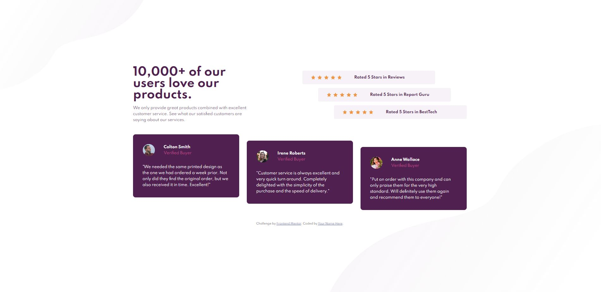

# Frontend Mentor - Social proof section solution

This is a solution to the [Social proof section challenge on Frontend Mentor](https://www.frontendmentor.io/challenges/social-proof-section-6e0qTv_bA). Frontend Mentor challenges help you improve your coding skills by building realistic projects. 

## Table of contents

- [Overview](#overview)
  - [The challenge](#the-challenge)
  - [Screenshot](#screenshot)
  - [Links](#links)
- [My process](#my-process)
  - [Built with](#built-with)
  - [What I learned](#what-i-learned)
- [Author](#author)

## Overview

### The challenge

Users should be able to:

- View the optimal layout for the section depending on their device's screen size

### Screenshot

### Links

- Solution URL: [@SStranks87](https://github.com/SStranks/MyFirstRepository/tree/master/FrontEndMentor/3_Social_Proof)
- Live Site URL: [@Netlify](https://angry-hodgkin-d9f714.netlify.app/)

## My process

### Built with

- Semantic HTML5 markup
- CSS custom properties
- Flexbox

### What I learned

I spent time researching the 'background-image' property, in order to create the 5-stars in the review boxes using only an empty .div. Unfortunately it is not possible to add padding between the repeated background image (single star). Attempted to use 'content-box' and padding, a method I found on StackOverflow, which worked to a degree but offered no precise repeatable control.

Learned the importance of the height property! When re-sizing for mobile view the contents of the page were extending off the top, because I had not correctly set the height property on the 'container' to max-content and there was overspill.

Using the psuedo-element (::before/after) you can easily attach background images to the body, and also attach multiple images in the background-image property. Keeping the code cleaner.

## Author

- Frontend Mentor - [@SStranks](https://www.frontendmentor.io/profile/SStranks)
