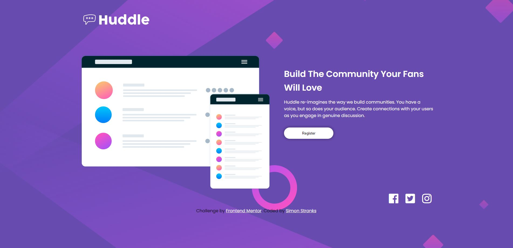

# Frontend Mentor - Huddle landing page with single introductory section solution

This is a solution to the [Huddle landing page with single introductory section challenge on Frontend Mentor](https://www.frontendmentor.io/challenges/huddle-landing-page-with-a-single-introductory-section-B_2Wvxgi0). Frontend Mentor challenges help you improve your coding skills by building realistic projects. 

## Table of contents

- [Overview](#overview)
  - [The challenge](#the-challenge)
  - [Screenshot](#screenshot)
  - [Links](#links)
- [My process](#my-process)
  - [Built with](#built-with)
  - [What I learned](#what-i-learned)
- [Author](#author)

## Overview

### The challenge

Users should be able to:

- View the optimal layout for the page depending on their device's screen size
- See hover states for all interactive elements on the page

### Screenshot

### Links

- Solution URL: [@SStranks87](https://github.com/SStranks/MyFirstRepository/tree/master/FrontEndMentor/5_Huddle_Landing)
- Live Site URL: [@Netlify](https://infallible-kowalevski-422990.netlify.app/)

## My process

### Built with

- Semantic HTML5 markup
- CSS custom properties
- Flexbox
- CSS Grid

### What I learned

Getting a better handle on responsive layouts, utilizing grid and having content adjust responsively.

## Author

- Frontend Mentor - [@SStranks](https://www.frontendmentor.io/profile/SStranks)