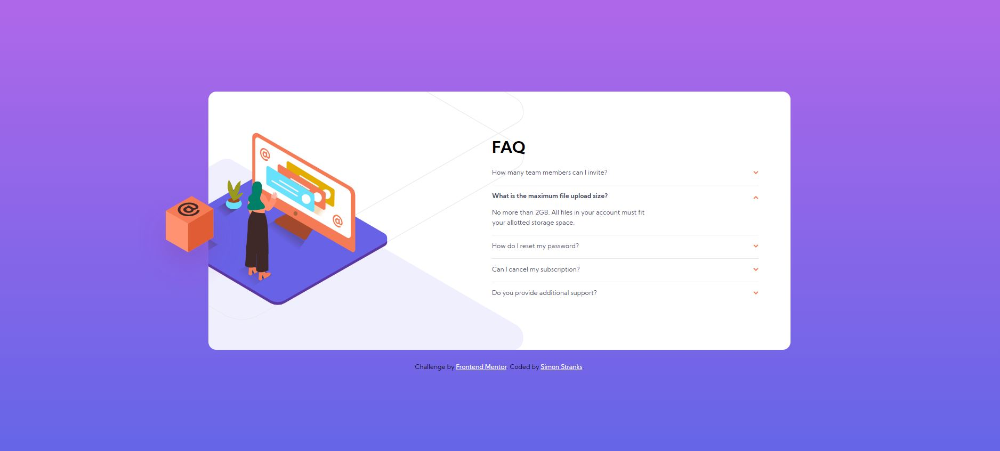

# Frontend Mentor - FAQ accordion card solution

This is a solution to the [FAQ accordion card challenge on Frontend Mentor](https://www.frontendmentor.io/challenges/faq-accordion-card-XlyjD0Oam). Frontend Mentor challenges help you improve your coding skills by building realistic projects. 

## Table of contents

- [Overview](#overview)
  - [The challenge](#the-challenge)
  - [Screenshot](#screenshot)
  - [Links](#links)
- [My process](#my-process)
  - [Built with](#built-with)
  - [What I learned](#what-i-learned)
- [Author](#author)

## Overview

### The challenge

Users should be able to:

- View the optimal layout for the component depending on their device's screen size
- See hover states for all interactive elements on the page
- Hide/Show the answer to a question when the question is clicked

### Screenshot

### Links

- Solution URL: [@SStranks87](https://github.com/SStranks/MyFirstRepository/tree/master/FrontEndMentor/6_Accordian_Card)
- Live Site URL: [@Netlify](https://epic-kowalevski-1f6d52.netlify.app/)

## My process

### Built with

- Semantic HTML5 markup
- CSS custom properties
- Flexbox
- CSS Grid

### What I learned

In this challenge I figrued out how to implement the solution using only CSS (no JS). This was accomplished by using the :target psuedo-class and targeting the entire 'li', then using the :target to alter properties on different classes on different elements (bold text, arrow flip, display).

I also learnt how to clip one image whilst leaving another unaffected by the overflow property, by utilizing a nested approach that I found at: [Solution](http://jsfiddle.net/kv0bLpw8/). Unfortunately I was not able to fully complete the positioning of the images at the mobile screen size.. for some reason I could not get the behaviour correct despite repeated experimentation. Perhaps I implemented the general structuring of the images and their respective styling incorrectly, and a better method could have been used.

## Author

- Frontend Mentor - [@SStranks](https://www.frontendmentor.io/profile/SStranks)