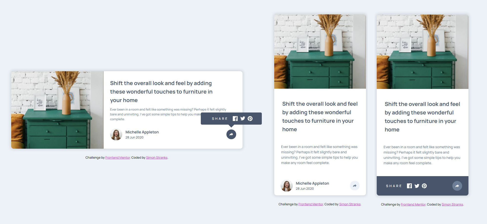

# Frontend Mentor - Article preview component solution

This is a solution to the [Article preview component challenge on Frontend Mentor](https://www.frontendmentor.io/challenges/article-preview-component-dYBN_pYFT). Frontend Mentor challenges help you improve your coding skills by building realistic projects. 

## Table of contents

- [Overview](#overview)
  - [The challenge](#the-challenge)
  - [Screenshot](#screenshot)
  - [Links](#links)
- [My process](#my-process)
  - [Built with](#built-with)
  - [What I learned](#what-i-learned)
- [Author](#author)
- [Acknowledgments](#acknowledgments)

## Overview

### The challenge

Users should be able to:

- View the optimal layout for the component depending on their device's screen size
- See the social media share links when they click the share icon

### Screenshot

### Links

- Solution URL: [@SStranks87](https://github.com/SStranks/MyFirstRepository/tree/master/FrontEndMentor/7_Article_Preview)
- Live Site URL: [@Netlify](https://cocky-feynman-f56a4d.netlify.app/)

## My process

### Built with

- Semantic HTML5 markup
- CSS custom properties
- Flexbox
- CSS Grid

### What I learned

In this challenge I implemented my first real bit of JavaScript, utilizing the 'toggle' method to add/remove classes to elements to affect visual changes to the 'share navbar'. 

Used the psuedo-element '::after' to create a triangle for the share navbar.

Realized the limitations of utilizing the 'overflow' property to force border-radius on the parent element - the share navbar could not be positioned correctly and simultaneously ignore the overflow. Resorted to using border-radius on the image/child element instead.

## Author

- Frontend Mentor - [@SStranks](https://www.frontendmentor.io/profile/SStranks)